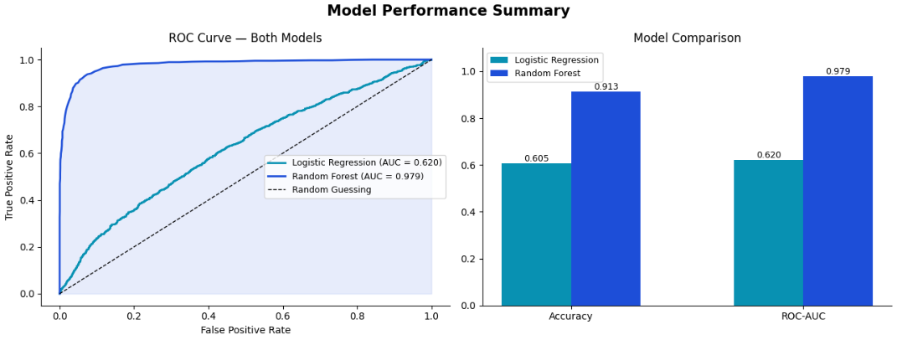
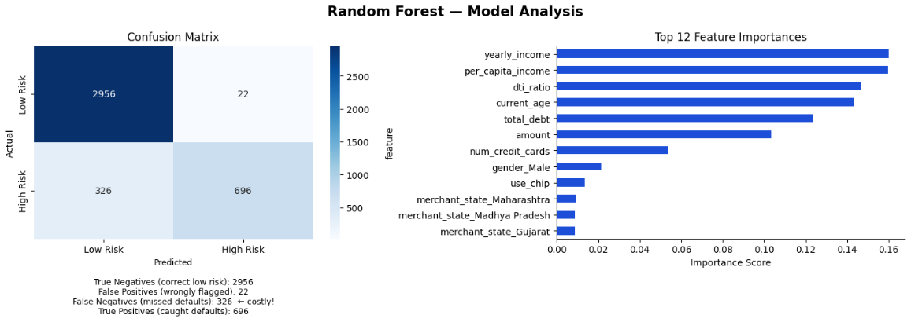
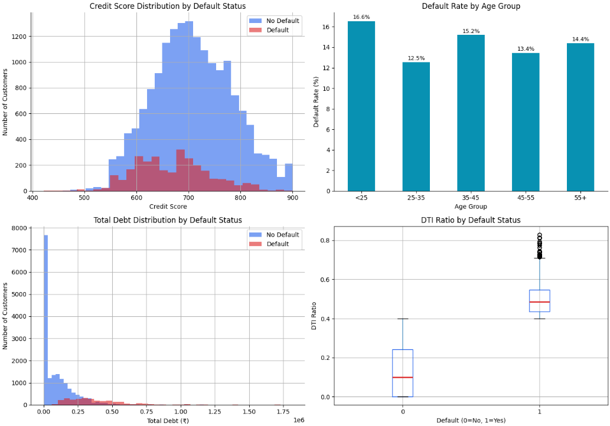

# 🏦 Indian EMI Loan Default Predictor

> A machine learning project that predicts high-risk loan customers using financial profiles of 20,000 Indian customers — built with Python, scikit-learn, and visualised in Google Looker Studio.

---

## 📊 Interactive Dashboard


> 🔗 [View Live Interactive Dashboard →](https://datastudio.google.com/s/l0LYN880_i0)

Features cross-filtering, India state map, feature importance heatmap, and age group analysis.

---

## 💡 Key Findings

| # | Finding | Detail |
|---|---------|--------|
| 1 | **Yearly income is the strongest predictor** | Importance score 0.1599 — customers with lower income relative to debt are significantly more likely to default |
| 2 | **Age matters more than expected** | Customers aged 55+ have the highest default rate — older customers carry more accumulated debt |
| 3 | **DTI ratio is the 3rd most important feature** | Debt-to-income ratio (0.1467 importance) confirms that relative debt burden matters more than absolute debt amount |
| 4 | **Random Forest vastly outperforms Logistic Regression** | AUC 0.979 vs 0.620 — the relationship between features and default is non-linear |
| 5 | **Model weakness: 326 missed defaults** | Recall for high-risk customers = 68% — false negatives remain a challenge worth addressing |

---

## 🤖 Model Performance

| Model | Accuracy | ROC-AUC | Recall (High Risk) |
|-------|----------|---------|-------------------|
| Logistic Regression | 60.5% | 0.620 | 55% |
| **Random Forest** | **91.3%** | **0.979** | **68%** |

### Confusion Matrix (Random Forest)
```
                 Predicted Low Risk   Predicted High Risk
Actual Low Risk       2,956                  22
Actual High Risk        326                 696
```

- ✅ Correctly identified low risk: **2,956**
- ✅ Correctly caught defaulters: **696**
- ⚠️ Missed defaulters (costly): **326**
- False alarms: **22**

---

## 📈 Charts & Visualisations

### Model Performance Summary


### Confusion Matrix + Feature Importance


### Exploratory Data Analysis


---

## 🗂️ Dataset

| Metric | Value |
|--------|-------|
| Total rows | 20,000 |
| Features used | 20 |
| Default definition | Credit score < 650 (CIBIL high-risk threshold) |
| Default rate | 25.6% |
| Source | Kaggle — Indian Customer Financial Profiles |

**Key columns used:**
`current_age` · `gender` · `yearly_income` · `per_capita_income` · `total_debt` · `credit_score` · `num_credit_cards` · `dti_ratio` · `amount` · `use_chip` · `merchant_state`

---

## 🛠️ Tools & Technologies

| Tool | Purpose |
|------|---------|
| Python | Core language |
| pandas + numpy | Data cleaning & feature engineering |
| scikit-learn | ML models (Logistic Regression + Random Forest) |
| matplotlib + seaborn | Static visualisation |
| Google Looker Studio | Interactive dashboard |
| Google Colab | Development environment |
| GitHub | Version control |

---

## 📁 Project Structure

```
Indian-emi-default-prediction/
│
├── emi_loan_default_predictor.ipynb   ← main notebook
│
├── data/
│   ├── customers.csv                  ← 20,000 customers with predictions
│   ├── age_summary.csv                ← default rate by age group
│   ├── feature_importance.csv         ← ML feature importance scores
│   └── state_summary.csv              ← state-wise risk summary
│
├── charts/
│   ├── eda_charts.png                 ← exploratory analysis
│   ├── model_analysis.png             ← confusion matrix + feature importance
│   └── model_performance.png          ← ROC curve + model comparison
│
└── README.md
```

---

## 🚀 How to Run

### Option 1 — Google Colab (recommended)
1. Open `emi_loan_default_predictor.ipynb` in Google Colab
2. Run **Cell 1** — installs all libraries
3. Run **Cell 2** — upload `Customer_financial_profiles.csv` when prompted
4. Run all remaining cells top to bottom
5. Charts auto-save, CSVs auto-download

### Option 2 — Local
```bash
git clone https://github.com/Siya-Tambe/Indian-emi-default-prediction.git
cd Indian-emi-default-prediction
pip install scikit-learn pandas matplotlib seaborn
jupyter notebook emi_loan_default_predictor.ipynb
```

---

## 🧠 What I Learned

**Data leakage** — first attempt gave 100% accuracy because `dti_ratio` and `total_debt` directly defined the target variable. Fixed by redefining default using only credit score. This is one of the most common and costly mistakes in real ML projects.

**Class imbalance** — used `class_weight='balanced'` to prevent the model from ignoring the minority class (defaulters). Without this, the model could score 74% accuracy by just predicting "no default" for everyone.

**Linear vs non-linear** — Logistic Regression's AUC of 0.620 vs Random Forest's 0.979 proves that the relationship between financial features and default risk is highly non-linear. Tree-based models are essential here.

**Recall vs accuracy** — in banking, missing a real defaulter (false negative) costs more than a false alarm. Accuracy alone is a misleading metric for imbalanced financial data.

---

## 🔮 What I'd Build Next

- Tune Random Forest with `GridSearchCV` to improve recall from 68% → 80%+
- Try **XGBoost** — likely to outperform Random Forest on tabular data
- Build a **Flask API** so the model accepts new customer profiles and returns risk score
- Add **SHAP values** for explainability — show why each prediction was made
- Collect actual loan repayment data for a more realistic default label

---

## ⚠️ Disclaimer

This model is for **educational purposes only** and is not intended for actual credit decisions. The default label is derived from credit score thresholds as a proxy — not from real loan repayment data.

---

*Built by Siya Tambe — Second year Computer Engineering student, Pune*

[](https://github.com/Siya-Tambe)
